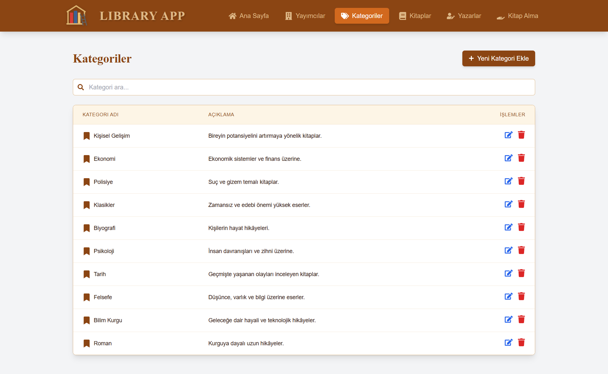
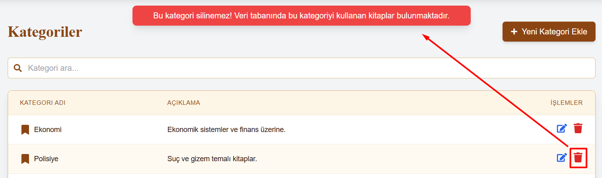

# 📚 Library Management App | React + Vite + Tailwind


[🇹🇷 Click here for the Turkish README](./README.tr.md)


*Created on: May 2025*

A modern, user-friendly web application for library management. Developed with React, Vite, and Tailwind CSS, fully integrated with a Spring Boot-based backend API.

* This project is designed to manage books, authors, publishers, categories, and borrowing operations.
* **React**, **Vite**, **Tailwind CSS**, **Spring Boot**, and **PostgreSQL** are used. The frontend was built with React for the provided backend project.
* Features a modern and responsive interface.

---

## 🌐 Live Demo

* Projenin Canlı Linki : [ https://library-app-frontend-omega.vercel.app/ ]
* Backend : [ https://library-app-backend-w6qr.onrender.com ]
* Categories API: [ https://library-app-backend-w6qr.onrender.com/api/v1/categories ] 
* Publishers API: [ https://library-app-backend-w6qr.onrender.com/api/v1/publishers ] 
* Authors API: [ https://library-app-backend-w6qr.onrender.com/api/v1/authors ] 
* Books API: [ https://library-app-backend-w6qr.onrender.com/api/v1/books ] 
* Boorrows API: [ https://library-app-backend-w6qr.onrender.com/api/v1/borrows ]

> **Note:** After sending a request, it may take a few minutes for the data to load. Render puts the backend to sleep when there is no request for a while.

---

## :computer: Installation & Usage

1. Clone the project
```bash
git clone https://github.com/tunahanyasar/library-app-frontend.git
```

2. Go to the frontend folder
```bash
cd library-app-frontend
```

3. Install dependencies
```bash
npm install
```

4. Start the development server
```bash
npm run dev
```


> **Note**: The backend application is deployed on Render. It may take a few minutes for the data to load. Please be patient while waiting.
---
## 🎮 How to Use?

1. **Home Page:**
   - View all books, authors, publishers, and categories in the library.
   - Use the search boxes to filter.
   - Edit or delete any record.

2. **Add/Edit Book:**
   - Click the "Add New Book" button.
   - Enter book details in the modal and save.
   - To edit a book, click the edit icon in the relevant row.

3. **Borrow Book:**
   - On the "Borrow Book" page, select the book and user to borrow.
   - Manage borrowing and return operations.
> **Note:** The data in this application is securely backed up. You can freely add, delete, or update any data as you wish. All changes can be reverted if needed, so feel free to make any modifications you like..

---

## 📜 Project Structure

:open_file_folder: **Folders;**
* *src/*
  * *components/*
    * *Modal.jsx*
    * *Form.jsx*
    * *Header.jsx*
    * *Layout.jsx*
  * *pages/*
    * *Books.jsx*
    * *Authors.jsx*
    * *Publishers.jsx*
    * *Categories.jsx*
    * *BorrowBook.jsx*
    * *Home.jsx*
  * *services/*
    * *api.js*
  * *App.jsx*
  * *index.css*
  * *main.jsx*
* *index.html*
* *package.json*
* *tailwind.config.js*
* *vite.config.js*

1. ***src/components/***: Shared UI components (modal, form, header, layout).
2. ***src/pages/***: React components for each main page (books, authors, publishers, categories, borrow, home).
3. ***src/services/api.js***: Functions for backend API communication.
4. ***index.css*** and ***tailwind.config.js***: All style and theme settings.

---

## :star2: Features

1. **CRUD Operations**
   - Add, edit, delete, and list books. Screenshot: [Add Book](#add-book)
   - Add, edit, delete, and list authors. Screenshot: [Add Author](#add-author)
   - Add, edit, delete, and list publishers. Screenshot: [Add Publisher](#add-publisher)
   - Add, edit, delete, and list categories. Screenshot: [Add Category](#add-category)
   - Book borrowing and return operations
   Screenshot: [Add Borrow](#add-borrow)
   **NOTE:**
        * Categories used in the database cannot be deleted.
        * If an author or publisher is deleted, all related data *(Books, Borrow Records)* will also be deleted.
        * Deleted data cannot be recovered. They are permanently removed.

2. **Search & Filtering**
   - Search by book, author, publisher, and category
   - Multi-category selection
   - Instant filtering
   Screenshot: [Searchbar Publishers](#search-publisher)
   - On the borrow page, you can search separately by book name and by person name.
   Screenshot: [Searchbar Borrow](#search-by-book-name)

3. **Modern UI/UX**
   - Responsive and user-friendly interface.
   Screenshot: [Pages](#paperclip-page-screenshots--fullpages)
   - Clean and organized code structure
   - Notification system (success/error alerts, all actions are shown to the user via alerts)
   Screenshot: [Alerts](#paperclip-page-screenshots--alerts)
   - Add/edit/delete operations via modal
   - Dark and light mode compatible design

4. **Extra Features**
   - Stock management in book borrowing and return operations
   - Related book check when deleting categories
   - Confirmation modals for bulk data deletion
   - Automatic sorting of data (most recently updated/added at the top)
   - Automatic truncation of long texts with "..."

---

## 💡 Technologies & Key Learnings

**React:**
* Component Architecture
* Props System
* React Hooks (useState, useEffect, useCallback)
* Event Handling
* Conditional Rendering
* React Router

**Tailwind CSS:**
* Utility-first CSS
* Responsive Design
* Custom Theme
* Modern and fast style management

**JavaScript:**
* ES6+ Features
* Array Methods
* API Integration (Axios)
* State Management
* Asynchronous Programming

**Backend (Spring Boot):**
* RESTful API
* Data management with PostgreSQL
* CORS and security settings

---

## 🔍 Detailed Explanation

### Project Purpose & Scope

This project is developed to help small and medium-sized libraries easily manage books, authors, publishers, categories, and borrowing operations. With its modern interface and strong backend integration, it offers a fast and secure experience.

### Technical Details

#### Books.jsx - Books Page Component

- Listing, adding, editing, and deleting books
- Multi-category selection and filtering
- Association with author and publisher
- Stock management and borrowing integration

#### BorrowBook.jsx - Borrow Component

- Book borrowing and return operations
- Stock update
- User-specific notifications

#### Notification System
- Alerts are shown below the header for success and error cases
- Confirmation modals for delete and bulk delete operations

---

## 📝 Code Standards & Comments
- All main components (Form, Modal, Header, Layout, page components) include detailed explanations and comments.
- Functions, states, and important JSX blocks are explained for readability and maintainability.
- The index.css file contains explanatory comments for main sections and custom styles.

## ⚠️ User Warnings & Modal Usage
- For delete operations, modals open to warn and ask for confirmation about related data.
- When an author, publisher, or category is deleted, all related books are also deleted.
- Deleted data cannot be recovered.
- Books cannot be added without adding a category, author, and publisher first.
- Notifications are shown sticky and fixed at the top and center of the screen.

## 🎨 UI/UX & Accessibility
- Header is fixed and gets a blur effect on scroll.
- Modal titles are highlighted, large, and bold.
- Form inputs and buttons are accessible and have a modern design.
- All forms and modals provide clear warnings and guidance to the user.

## 🔄 Latest Updates
- Explanatory comments and headings added throughout the code.
- Modal and notification systems improved.
- All delete operations now warn about related data and irreversibility.
- When updating a borrow record, book and email fields are disabled and show current data only in update mode.
- Explanatory comments added to sections and important areas in index.css.
---
# :paperclip: Page Screenshots : Fullpages

### Home Page


### Publishers Page


### Categories Page


### Books Page


### Authors Page


### Borrow Page


# :paperclip: Page Screenshots : CRUD

### Add Book


### Add Author


### Add Category


### Add Publisher


### Add Borrow


# :paperclip: Page Screenshots : Alerts

### Category Delete Alert


### Category Add Alert


### Author Delete Modal


### Publisher Delete Modal


# :paperclip: Page Screenshots : Searchbar
### Search Publisher


### Search by Book Name


### Search by Person Name


---

## 📞 Contact

[Tunahan Yaşar](https://github.com/tunahanyasar)

* GitHub: [@tunahanyasar](https://github.com/tunahanyasar)
* LinkedIn: [Tunahan Yaşar](https://www.linkedin.com/in/tunahan-yasar/)

---

## 📚 Resources & References


- [Backend Repo](https://github.com/FurkanTsdmr/LibraryAppSpringBoot)

- [React](https://react.dev/)
- [Vite](https://vitejs.dev/)
- [Tailwind CSS](https://tailwindcss.com/)
- [Spring Boot](https://spring.io/projects/spring-boot)
- [PostgreSQL](https://www.postgresql.org/)


