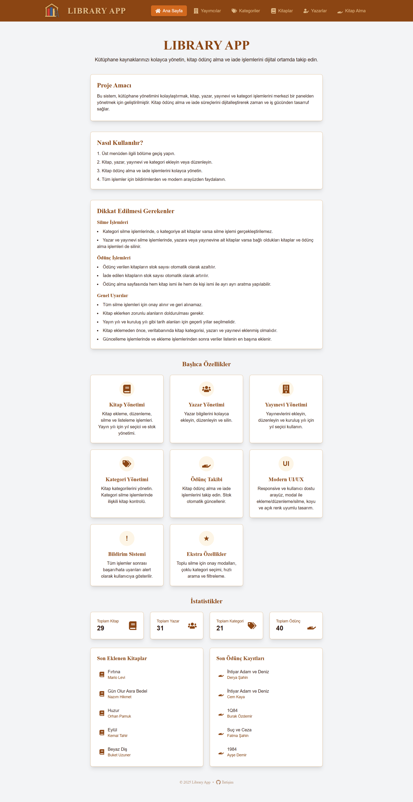
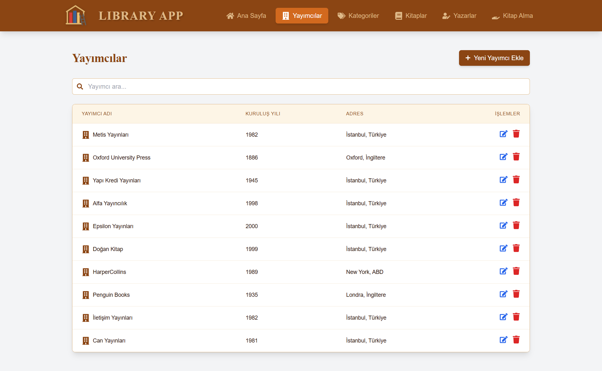
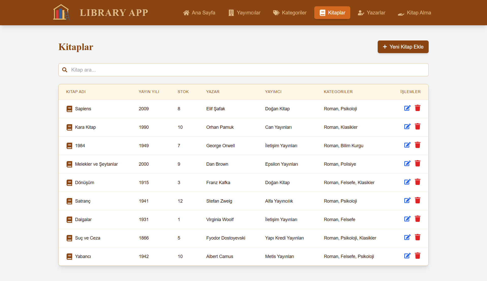
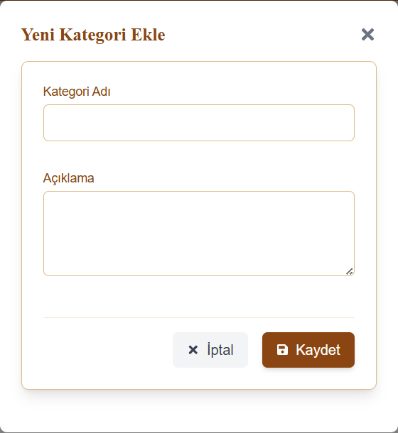
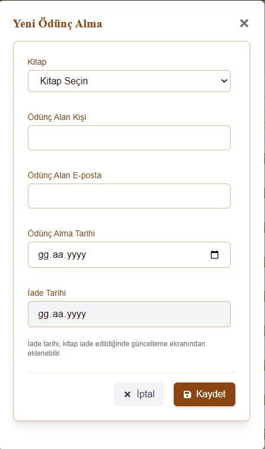
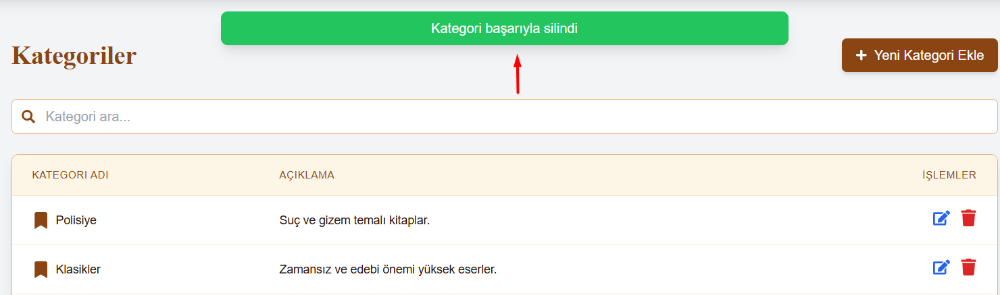
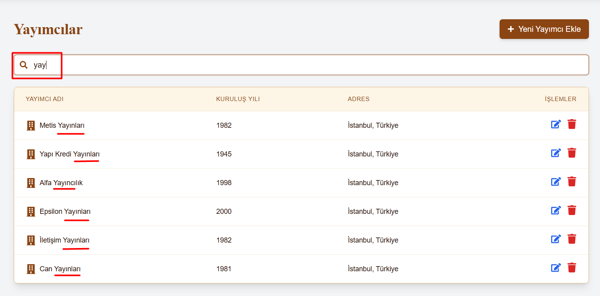
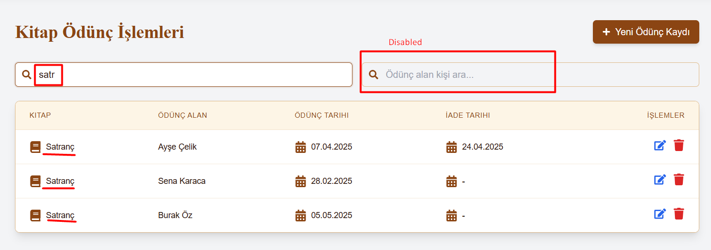

# 📚 Kütüphane Yönetim Uygulaması | React + Vite + Tailwind

[🇬🇧 İngilizce README için tıklayın](./README.md)

*Oluşturulma Tarihi: Mayıs 2025*

Modern, kullanıcı dostu bir kütüphane yönetim web uygulamasıdır. React, Vite ve Tailwind CSS ile geliştirilmiş olup, Spring Boot tabanlı bir backend API ile tam entegredir.

* Bu proje; kitap, yazar, yayınevi, kategori ve ödünç alma işlemlerini yönetmek için tasarlanmıştır.
* **React**, **Vite**, **Tailwind CSS**, **Spring Boot** ve **PostgreSQL** kullanılmıştır. Frontend, verilen backend projesi için React ile hazırlanmıştır.
* Modern ve responsive bir arayüze sahiptir.

---

## 🌐 Canlı Demo

- **Frontend:** [https://library-app-frontend-omega.vercel.app/](https://library-app-frontend-omega.vercel.app/)
- **Backend:** [https://library-app-backend-jtd1.onrender.com](https://library-app-backend-jtd1.onrender.com)
- **Kategoriler API:** [https://library-app-backend-jtd1.onrender.com/api/v1/categories](https://library-app-backend-jtd1.onrender.com/api/v1/categories)
- **Yayınevleri API:** [https://library-app-backend-jtd1.onrender.com/api/v1/publishers](https://library-app-backend-jtd1.onrender.com/api/v1/publishers)
- **Yazarlar API:** [https://library-app-backend-jtd1.onrender.com/api/v1/authors](https://library-app-backend-jtd1.onrender.com/api/v1/authors)
- **Kitaplar API:** [https://library-app-backend-jtd1.onrender.com/api/v1/books](https://library-app-backend-jtd1.onrender.com/api/v1/books)
- **Ödünçler API:** [https://library-app-backend-jtd1.onrender.com/api/v1/borrows](https://library-app-backend-jtd1.onrender.com/api/v1/borrows)

> **Not:** Backend Render üzerinde barındırılmaktadır. Uzun süre istek yapılmazsa uyku moduna geçer ve ilk istekte verilerin gelmesi birkaç dakika sürebilir.

---

## :computer: Kurulum ve Kullanım

1. Projeyi klonlayın
   ```bash
   git clone https://github.com/tunahanyasar/library-app-frontend.git
   ```
2. Frontend klasörüne gidin
   ```bash
   cd library-app-frontend
   ```
3. Bağımlılıkları yükleyin
   ```bash
   npm install
   ```
4. Geliştirme sunucusunu başlatın
   ```bash
   npm run dev
   ```

> **Not:** Backend uygulaması Render üzerinde barındırılmaktadır. Verilerin yüklenmesi birkaç dakika sürebilir. 

---
## 🎮 Nasıl Kullanılır?

1. **Ana Sayfa:**
   - Kütüphanedeki tüm kitapları, yazarları, yayınevlerini ve kategorileri görüntüleyin.
   - Arama kutularını kullanarak filtreleme yapın.
   - Herhangi bir kaydı düzenleyin veya silin.

2. **Kitap Ekle/Düzenle:**
   - "Yeni Kitap Ekle" butonuna tıklayın.
   - Açılan modalda kitap bilgilerini girin ve kaydedin.
   - Kitapları düzenlemek için ilgili satırdaki düzenle ikonuna tıklayın.

3. **Ödünç Alma:**
   - "Ödünç Alma" sayfasında ödünç alınacak kitabı ve kullanıcıyı seçin.
   - Ödünç alma ve iade işlemlerini yönetin.

---
## 📜 Proje Yapısı

:open_file_folder: **Klasörler;**
* *src/*
  * *components/*
    * *Modal.jsx*
    * *Form.jsx*
    * *Header.jsx*
    * *Layout.jsx*
  * *pages/*
    * *Books.jsx*
    * *Authors.jsx*
    * *Publishers.jsx*
    * *Categories.jsx*
    * *BorrowBook.jsx*
    * *Home.jsx*
  * *services/*
    * *api.js*
  * *App.jsx*
  * *index.css*
  * *main.jsx*
* *index.html*
* *package.json*
* *tailwind.config.js*
* *vite.config.js*

1. ***src/components/***: Ortak arayüz bileşenleri (modal, form, header, layout).
2. ***src/pages/***: Her ana sayfa için React bileşenleri (kitaplar, yazarlar, yayınevleri, kategoriler, ödünç, ana sayfa).
3. ***src/services/api.js***: Backend API ile iletişim fonksiyonları.
4. ***index.css*** ve ***tailwind.config.js***: Tüm stil ve tema ayarları.

---

## :star2: Özellikler

1. **CRUD İşlemleri**
   - Kitap ekle, düzenle, sil ve listele. Görsel: [Kitap Ekle](#kitap-ekle)
   - Yazar ekle, düzenle, sil ve listele. Görsel: [Yazar Ekle](#yazar-ekle)
   - Yayımcı ekle, düzenle, sil ve listele. Görsel: [Yayımcı Ekle](#yayımcı-ekle)
   - Kategori ekle, düzenle, sil ve listele. Görsel: [Kategori Ekle](#kategori-ekle)
   - Kitap ödünç alma ve iade işlemleri. Görsel: [Ödünç Alma Ekle](#ödünç-alma-ekle)
   **NOT:**
        * Veritabanında kullanılan kategoriler silinemez.
        * Bir yazar veya yayımcı silinirse, ona bağlı tüm veriler *(Kitaplar, Ödünç Kayıtları)* de silinir.
        * Silinen veriler geri getirilemez, tamamen silinir.

2. **Arama & Filtreleme**
   - Kitap, yazar, yayımcı ve kategoriye göre arama
   - Çoklu kategori seçimi
   - Anlık filtreleme
   - Yayımcı arama görseli: [Yayımcı Arama](#yayımcı-arama)
   - Ödünç alma sayfasında kitap adına veya kişi adına göre ayrı ayrı arama yapılabilir. Görseller: [Kitap Adı ile Arama](#kitap-adı-ile-arama), [Kişi Adı ile Arama](#kişi-adıyla-arama)

3. **Modern Arayüz ve Kullanıcı Deneyimi**
   - Responsive ve kullanıcı dostu arayüz. Görsel: [Sayfa Ekran Görüntüleri](#ana-sayfa)
   - Temiz ve düzenli kod yapısı
   - Bildirim sistemi (başarı/hata uyarıları, yapılan işlemler alert ile kullanıcıya gösterilir). Görsel: [Bildirimler](#kategori-silme-bildirimi)
   - Modal ile ekleme/düzenleme/silme işlemleri
   - Koyu ve açık tema desteği

4. **Ekstra Özellikler**
   - Ödünç alma ve iade işlemlerinde stok yönetimi
   - Kategori silme işlemlerinde ilişkili kitap kontrolü
   - Toplu veri silme için onay modalları
   - Verilerin otomatik sıralanması (en son eklenen/güncellenen en üstte)
   - Uzun metinlerin otomatik kısaltılması ve "..." ile gösterilmesi

---

## 💡 Kullanılan Teknolojiler

- **React:**
  - Bileşen Mimarisi
  - Props Sistemi
  - React Hook'ları (useState, useEffect, useCallback)
  - Olay Yönetimi
  - Koşullu Render
  - React Router

- **Tailwind CSS:**
  - Utility-first CSS
  - Responsive Tasarım
  - Özel Tema
  - Modern ve hızlı stil yönetimi

- **JavaScript:**
  - ES6+ Özellikleri
  - Dizi Metodları
  - API Entegrasyonu (Axios)
  - State Yönetimi
  - Asenkron Programlama

- **Backend (Spring Boot):**
  - RESTful API
  - PostgreSQL ile veri yönetimi
  - CORS ve güvenlik ayarları

---

## 🔍 Detaylı Açıklama

### Proje Amacı ve Kapsamı

Bu proje, küçük ve orta ölçekli kütüphanelerin kitap, yazar, yayınevi, kategori ve ödünç alma işlemlerini kolayca yönetebilmesi için geliştirilmiştir. Modern arayüzü ve güçlü backend entegrasyonu ile hızlı ve güvenli bir deneyim sunar.

### Teknik Detaylar

#### Books.jsx - Kitaplar Sayfası Bileşeni

- Kitapların listelenmesi, eklenmesi, düzenlenmesi ve silinmesi
- Çoklu kategori seçimi ve filtreleme
- Yazar ve yayınevi ile ilişkilendirme
- Stok yönetimi ve ödünç alma entegrasyonu

#### BorrowBook.jsx - Ödünç Alma Bileşeni

- Kitap ödünç alma ve iade işlemleri
- Stok güncelleme
- Kullanıcıya özel bildirimler

#### Bildirim Sistemi
- Başarı ve hata durumlarında başlık altında uyarı gösterimi
- Silme ve toplu silme işlemlerinde onay modalları

---

## 📝 Kod Standartları & Açıklamalar
- Tüm ana bileşenlerde (Form, Modal, Header, Layout, sayfa bileşenleri) detaylı açıklama ve yorum satırları eklenmiştir.
- Fonksiyonlar, state'ler ve önemli JSX blokları okunabilirlik ve sürdürülebilirlik için açıklanmıştır.
- index.css dosyasında ana bölümler ve özel stiller için açıklayıcı yorumlar bulunmaktadır.

## ⚠️ Kullanıcı Uyarıları & Modal Kullanımı
- Silme işlemlerinde, ilişkili veriler hakkında uyarı ve onay isteyen modallar açılır.
- Yazar, yayınevi veya kategori silindiğinde, ilişkili tüm kitaplar da silinir.
- Silinen veriler geri getirilemez.
- Kategori, yazar ve yayınevi eklemeden kitap eklenemez.
- Bildirimler sticky ve fixed olarak ekranın üstünde ve ortasında gösterilir.

## 🎨 UI/UX & Erişilebilirlik
- Header sabit ve scroll ile blur efekti alır.
- Modal başlıkları vurgulu, büyük ve kalın olarak görünür.
- Form inputları ve butonlar erişilebilir ve modern tasarıma sahiptir.
- Tüm formlar ve modallar, kullanıcıya açıklayıcı uyarılar ve yönlendirmeler sunar.

## 🔄 Son Güncellemeler
- Kodun tamamında açıklayıcı yorumlar ve başlıklar eklendi.
- Modal ve bildirim sistemleri geliştirildi.
- Tüm silme işlemlerinde ilişkili veriler ve geri dönüşsüzlük hakkında uyarı veriliyor.
- Ödünç alma kaydı güncellenirken kitap ve email alanları sadece güncelleme modunda disabled ve mevcut veri gösteriliyor.
- index.css dosyasında bölümler ve önemli alanlar için açıklayıcı yorumlar eklendi.

---

# :paperclip: Sayfa Ekran Görüntüleri : Tüm Sekmeler

### Ana Sayfa


### Yayımcılar Sayfası


### Kategoriler Sayfası


### Kitaplar Sayfası


### Yazarlar Sayfası


### Ödünç Alma Sayfası


# :paperclip: Sayfa Ekran Görüntüleri : CRUD

### Kitap Ekle


### Yazar Ekle


### Kategori Ekle


### Yayımcı Ekle


### Ödünç Alma Ekle


# :paperclip: Sayfa Ekran Görüntüleri : Bildirimler

### Kategori Silme Bildirimi


### Kategori Ekleme Bildirimi


### Yazar Silme Modalı


### Yayımcı Silme Modalı


# :paperclip: Sayfa Ekran Görüntüleri : Arama Çubuğu

### Yayımcı Arama


### Kitap Adı ile Arama


### Kişi Adıyla Arama


---

## 📞 İletişim

[Tunahan Yaşar](https://github.com/tunahanyasar)

* GitHub: [@tunahanyasar](https://github.com/tunahanyasar)
* LinkedIn: [Tunahan Yaşar](https://www.linkedin.com/in/tunahan-yasar/)

---

## 📚 Kaynaklar & Referanslar

- [Backend Repo](https://github.com/FurkanTsdmr/LibraryAppSpringBoot)
- [React](https://react.dev/)
- [Vite](https://vitejs.dev/)
- [Tailwind CSS](https://tailwindcss.com/)
- [Spring Boot](https://spring.io/projects/spring-boot)
- [PostgreSQL](https://www.postgresql.org/) 